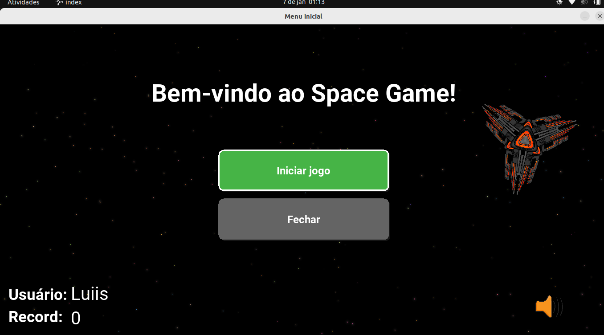
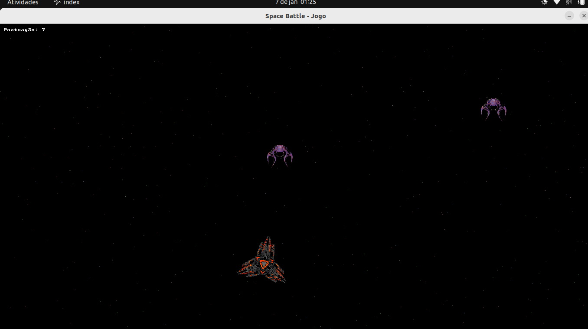
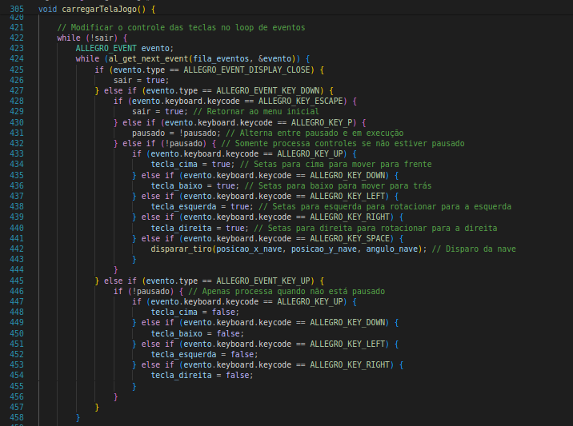

# Space Battle - Jogo

### Olá, esse é um jogo do tipo 'space battle' desenvolvido em linguagem C com a lib Allgro 5.

## Como Compilar o Jogo:

### Use o comando abaixo para compilar o jogo:

`gcc -o SpaceBattle index.c ./telas/game.c -lallegro -lallegro_font -lallegro_ttf -lallegro_primitives -lallegro_audio -lallegro_acodec -lallegro_dialog -lallegro_image -lm `

### Certifique-se de que você possui todas as dependências da biblioteca Allegro instaladas no seu sistema.

## Caso de Uso:

### Abaixo está o diagrama de caso de uso que representa o funcionamento geral do jogo:

## Funcionamento Geral do Jogo:

### Este é um jogo onde o jogador controla uma nave e deve evitar ser atingido pelos inimigos que aparecem no jogo. A dificuldade aumenta progressivamente conforme o tempo, com mais inimigos surgindo e movendo-se mais rápido.

## Funcionalidades:

### Menu Inicial:

- Botão para iniciar o jogo.

- Botão para fechar o jogo.

- Controle para ativar ou desativar a música de fundo.

- Visualização do nome do usuário e seu recorde atual.

### Tela do Jogo:

- Controle de nave utilizando o teclado.

- Sistema de pontuação que aumenta com o tempo e ao derrotar inimigos.

- Inimigos que seguem a nave do jogador, aumentando em quantidade e velocidade com o tempo.

- Mensagem de “Game Over” quando a nave é atingida, retornando ao menu inicial.

- Renderização de animação quando a nave é atingida.

- Sons interativos para os tiros da nave e para inimigos atingidos

- Implementação de menu de pause

### Loop de eventos principal do game:

## Considerações gerais:

### Fique a vontade para abrir issues ou sugerir melhorias!
### Tecnologias usadas: 
- Linguagem C 
- Compilador gcc
- Allegro 5
- link dos assets usados -> [acesse aqui](https://opengameart.org/content/space-game-assets) 

## Minhas redes sociais:

